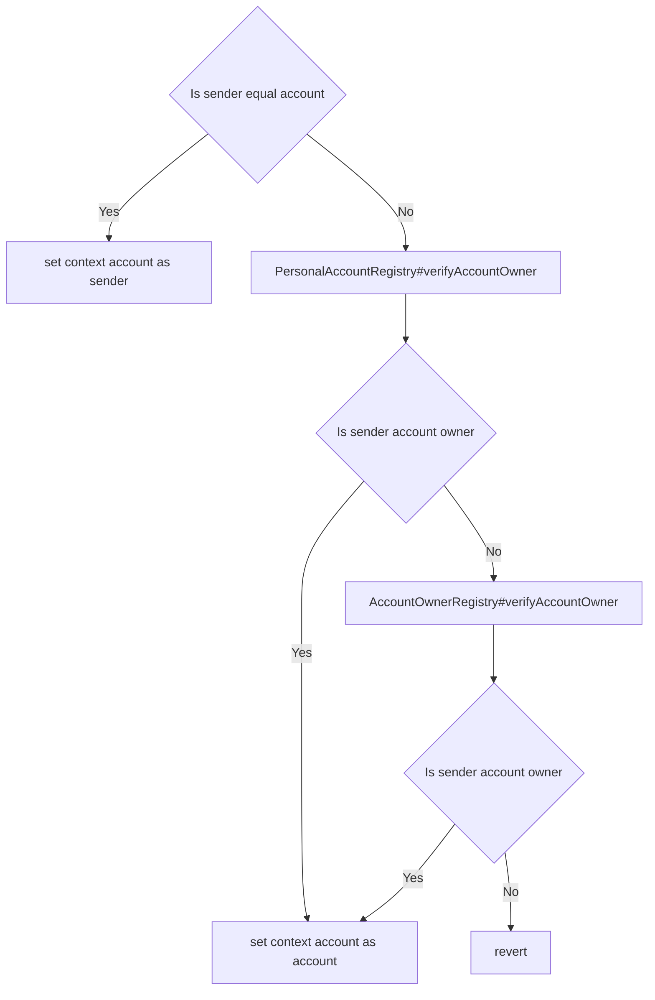

# Gateway and Gateway Recipients

## Simple Summary

[GSN](https://www.opengsn.org/) replacement.

## Motivation

Creating more developer friendly [GSN](https://www.opengsn.org/) with support for:
* batch transactions
* [Account Owner Registry](./account-owner-registry.md)
* [Personal Account Registry](./personal-account-registry.md)

## Definitions

* sender - `msg.sender` or key used for sign delegate call,
* account - contract or key based wallet,
* batch - structure of target addresses `address[] to` and target data `bytes[] data`

## Specification

`Gateway` has the following interface:

```solidity
interface Gateway {
  // public functions

  function sendBatch(
    address[] memory to,
    bytes[] memory data
  )
    external;

  function sendBatchFromAccount(
    address account,
    address[] memory to,
    bytes[] memory data
  )
    external;

  function delegateBatchFromAccount(
    address account,
    address[] memory to,
    bytes[] memory data,
    bytes memory senderSignature
  )
    external;

  // external functions (views)

  function getAccountNonce(
    address account
  )
    external
    view
    returns (uint256);
}
```

Target contracts should inherit from `GatewayRecipient` contract:

```solidity
contract GatewayRecipient {
  address public gateway;

  // internal functions (views)

  function _getContextAccount()
    internal
    view
    returns (address);

  function _getContextSender()
    internal
    view
    returns (address);
}

```

There are several options for batch sending.

* `sendBatch()` - send direct batch
* `sendBatchFromAccount()` - send direct batch from account
* `delegateBatchFromAccount()` - send a batch from account using different account (eg. relayer)

`delegateBatchFromAccount` recover address from sender signature. 

Sender delegate batch message data structure:

```solidity
bytes32 TYPE_HASH = keccak256("DelegatedBatch(uint256 nonce,address[] to,bytes[] data,uint256 gasPrice)");
```
*See: [signing data section](../signing-data.md)* 

In both `sendBatchFromAccount` and `delegateBatchFromAccount` sender need to be an owner of the account.

Account owner verification diagram: 



Target contract context addresses:

| gateway method | `_getContextSender` | `_getContextSender` |
| --- | --- | --- |
| `sendBatch()` | `msg.sender` | `msg.sender` | 
| `sendBatchFromAccount()` | `msg.sender` | `account` argument | 
| `delegateBatchFromAccount()` | recover from `senderSignature` | `account` argument | 


## Implementation

[gateway/Gateway.sol](../../src/gateway/Gateway.sol)

[gateway/GatewayRecipient.sol](../../src/gateway/GatewayRecipient.sol)
